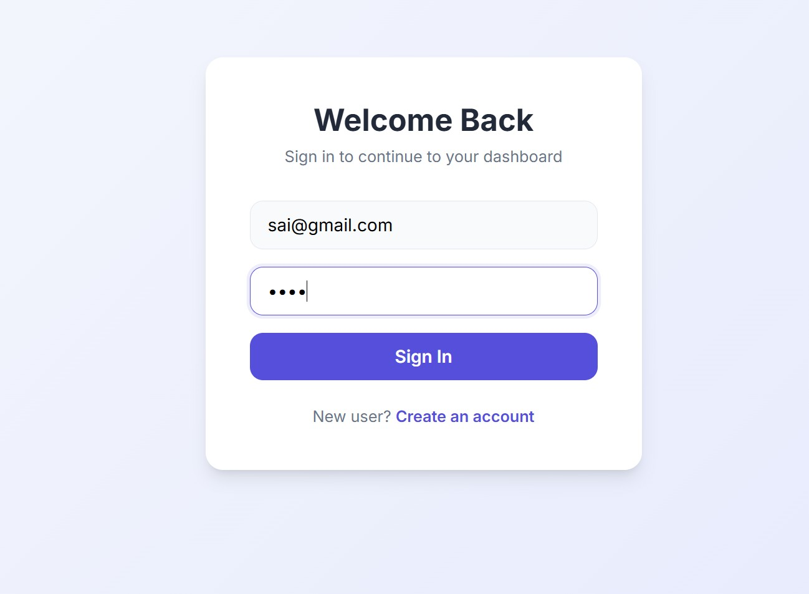
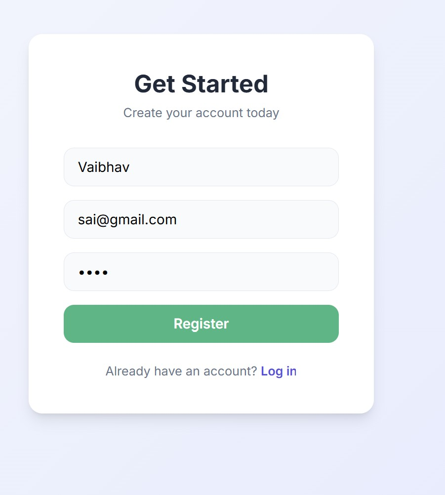
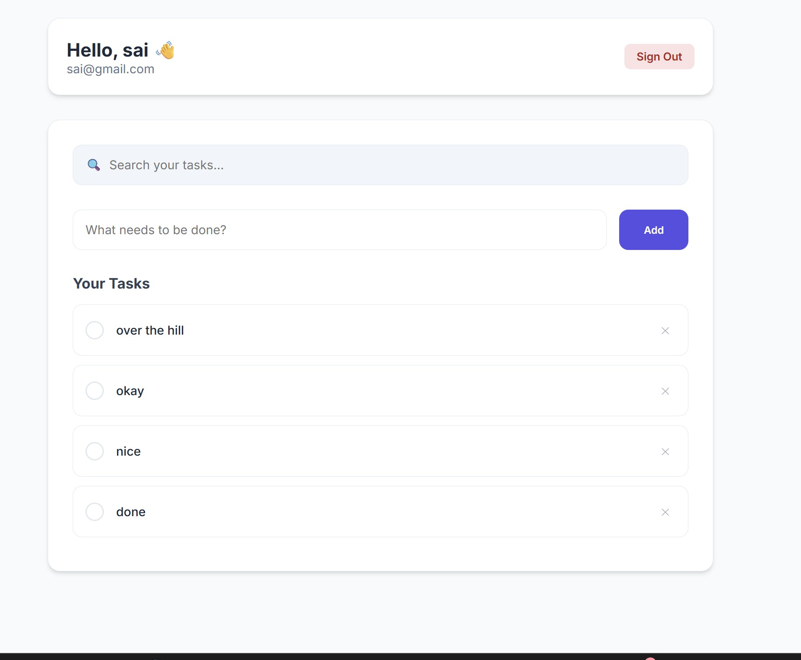
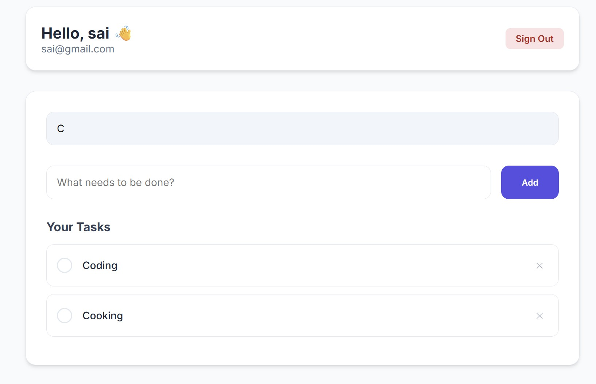

# Fullstack Auth Dashboard (React + Node.js)

A full-stack web application with JWT authentication, a protected dashboard, and CRUD task management.

## Preview

### Login Screen



### Register Screen


### Dashboard Screen



### Search & Filter



### Demo Video

https://github.com/user-attachments/assets/5233c666-5a10-44af-aa0f-d4a734f99ab6

## Features

- User authentication with JWT
- Secure login and registration
- Protected dashboard routes
- User profile display
- Task management (Create, Read, Update, Delete)
- Search and filter tasks
- Responsive UI
- Logout functionality

## Tech Stack

### Frontend
- React (Vite)
- React Router
- Axios

### Backend
- Node.js
- Express.js
- MongoDB + Mongoose
- JSON Web Tokens (JWT)
- bcrypt

## Project Structure

frontend/
- pages (Login, Register, Dashboard)
- components (ProtectedRoute, TaskForm, TaskList)
- services (API integration)

backend/
- controllers
- routes
- models
- middleware

## Authentication Flow

- Users authenticate using email and password
- On successful login, the backend issues a JWT
- The token is stored on the client
- Protected routes verify the JWT before granting access
- All task APIs are user-scoped and secured

## Getting Started

### Prerequisites
- Node.js (v18+)
- MongoDB (local or Atlas)

### Backend Setup

```bash
cd backend
npm install
npm run dev
 ```
### Frontend Setup
```bash
cd frontend
npm install
npm run dev
 ```
Frontend runs at: http://localhost:5173

Backend runs at: http://localhost:5000


---

## Environment Variables

Create a `.env` file inside the `backend/` directory with the following variables:

```env
PORT=5000
MONGO_URI=your_mongodb_connection_string
JWT_SECRET=your_secret_key

```


## Scalability & Future Improvements

- Migrate frontend to Next.js for SSR and performance
- Use HttpOnly cookies for enhanced security
- Implement refresh tokens
- Add pagination and indexing for large datasets
- Introduce role-based access control
- Containerize with Docker for deployment


## License

This project is for learning and portfolio purposes.
